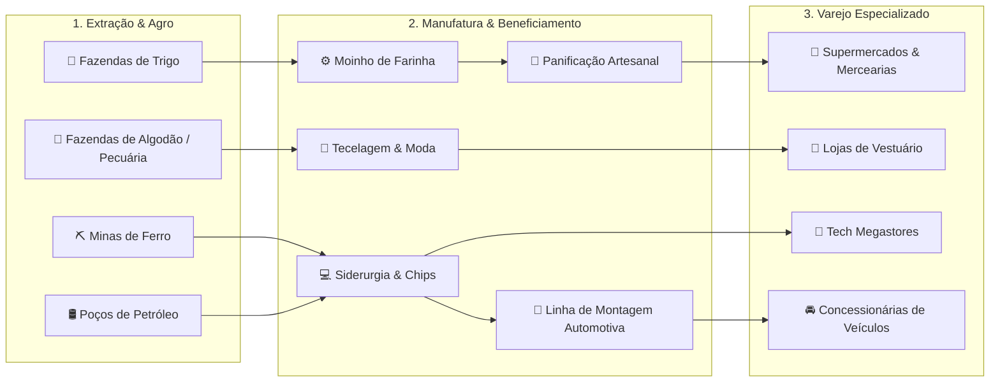

# 🏛️ OIKONOMIA — Simulador de Estratégia Econômica & Cadeia Produtiva

[](https://github.com/Jotasiete7/OIKONOMIA-game)
[-sky.svg)](https://github.com/Jotasiete7/OIKONOMIA-game)
[](https://github.com/Jotasiete7/OIKONOMIA-game)
[](https://github.com/Jotasiete7/OIKONOMIA-game)
[](LICENSE)

**OIKONOMIA** é um simulador econômico e empresarial profundo inspirado em clássicos como *Capitalism Lab*, *SimCity* e *Industry Giant*. O jogo combina um motor microeconômico de tempo contínuo com um vasto continente isométrico 2.5D de 128×128 blocos, integrando extração mineral, agropecuária, manufatura industrial, logística marítima e 8 redes especializadas de varejo.

---

## 🌟 Principais Recursos & Escalas do Jogo

### 🗺️ 1. Continente Isométrico de 128×128 (16.384 Tiles)
* **Geografia Costeira & Relevo Harmônico**: Praias naturais, águas profundas, colinas, cordilheiras e vales agrícolas férteis.
* **4 Cidades com Perfis Econômicos Reais**:
  - **🏛️ Nova Atenas (38, 38)**: Capital financeira e cultural de alta renda, com demanda por bens de luxo, moda e eletrônicos de alto QR.
  - **🚢 Porto Real (94, 38)**: O maior hub portuário e logístico do continente, situado na costa oceânica oriental com altíssimo volume de comércio.
  - **🏭 Montargis (38, 88)**: Polo industrial e siderúrgico no sudoeste, cercado por cordilheiras com ricos depósitos de ferro (*Desbloqueio: $500k de Patrimônio*).
  - **🌾 Várzea (88, 88)**: Vasto cinturão agropecuário nos vales férteis do sudeste (*Desbloqueio: 1 Fazenda ativa*).
* **Malha Rodoviária Suave & Pontes**: Autoestradas contínuas de pista dupla interligando todas as cidades e terminais portuários com pontes automáticas sobre a água.

---

### 🖥️ 2. Interface em Tela Cheia & Janelas Flutuantes (Estilo *Capitalism Lab*)
* **Canvas Edge-to-Edge**: O mapa ocupa 100% da janela do navegador sem barras de rolagem.
* **HUD Superior & Inferior Translúcido**: Controle fino com relógio contínuo, velocidades (`⏸ Pausa`, `1x`, `2x`, `5x`), saldo de caixa, lucro mensal, atalhos de cidades e lentes de calor (*Terreno, Tráfego, População, Varejo, Portos, Indústria, Mídia*).
* **🪟 Card Flutuante de Gestão**: Ao clicar em qualquer prédio (loja, fábrica, fazenda ou mina), uma janela flutuante elegante abre diretamente no canto direito sobre o mapa, sem rolagem.
* **📡 Radar Minimapa Interativo**: Renderização dedicada em tempo real com retângulo de visão da câmera e **teletransporte instantâneo por clique**.

---

### ⛓️ 3. Ecossistema de Cadeia de Suprimentos Completo (Vertical Integration)



* **63+ Produtos de Consumo & Insumos Industriais**: Alimentos, bebidas, tecidos, eletrodomésticos, hardware, joias, materiais de construção e automóveis.
* **35+ Receitas Industriais**: Interface com abas por categoria (`[🌾 Alimentos]`, `[👗 Moda]`, `[💻 Tech]`, `[🚗 Veículos]`, `[⚙️ Base]`) e busca em tempo real.
* **Seletor de Fornecedores com Selos Coloridos**:
  - 👑 **SUA EMPRESA (PRODUÇÃO PRÓPRIA)**: Fornecimento direto de fábricas/fazendas próprias com **custo de produção direto e zero margem de intermediários**.
  - 🚢 **PORTO MARÍTIMO (IMPORTAÇÃO INTERNACIONAL)**: Terminais oceânicos de atacado global.
  - 🏪 **DISTRIBUIDOR REGIONAL**: Fornecedores independentes terceirizados.

---

### 💰 4. Mecânicas Imobiliárias e de Desinvestimento (*Capitalism Lab Formulas*)

| Ação | Fórmula de Cálculo | Resultado Econômico |
| :--- | :--- | :--- |
| **💰 Vender Instalação** | `(Custo_Obra × 70%) + (Estoque_Armazenado × Custo_Unitário)` | Credita o valor imediatamente no caixa, liquida o estoque a preço de custo e libera o lote. |
| **🗑️ Demolir Edifício** | `(Custo_Obra × 40%)` | Recupera o valor residual da sucata, remove a estrutura e zera o aluguel diário da terra. |

---

## 🎮 Controles & Atalhos de Teclado

| Tecla / Comando | Ação |
| :--- | :--- |
| **`W` / `A` / `S` / `D`** ou **`Setas`** | Mover a câmera pelo mapa suavemente (60 FPS). |
| **`Scroll do Mouse`** ou **`Q` / `E`** | Zoom in / Zoom out. |
| **`Botão Esquerdo` (Arrastar)** | Panorâmica da câmera. |
| **`Clique no Lote / Prédio`** | Abrir janela flutuante de gestão ou wizard de construção. |
| **`Clique no Minimapa`** | Teletransportar a câmera diretamente para o ponto clicado. |
| **`Espaço`** | Pausar / Despausar o relógio da simulação. |
| **`Esc`** | Fechar janelas flutuantes, gavetas de DRE/Diário e modais. |
| **`F`** | Ocultar/Restaurar painéis (Modo Teatro). |

---

## 🚀 Como Executar o Jogo

### 1. Execução Imediata (Windows)
Basta dar um duplo clique no inicializador:
```cmd
JOGAR.bat
```
*O jogo abrirá diretamente no seu navegador padrão com motor gráfico e mapas carregados.*

### 2. Regeneração do Mapa (Opcional via Tiled ou Script)
Caso queira recompilar os dados do mapa procedural para o cliente:
```powershell
# Executar a ferramenta de exportação TMX -> JS
powershell -ExecutionPolicy Bypass -File tools/export_map_to_js.ps1
```

---

## 📂 Estrutura do Projeto

```
OIKONOMIA/
├── data/
│   ├── maps/
│   │   ├── oikonomia_map.tmx      # Mapa isométrico 128x128 no formato padrão Tiled
│   │   └── tileset.png            # Tileset isométrico 2:1 (64x32) com elevações e texturas
│   ├── cities/
│   │   └── city-profiles.json     # Demografia, curvas de renda, elasticidade e desbloqueio
│   └── products/                  # Catálogo de produtos, matérias-primas e receitas
├── client/
│   ├── index.html                 # Cliente completo com motor canvas 2D e UI em tela cheia
│   └── map_data.js                # Camadas TMX e matrizes compiladas para acesso ultra-rápido
├── docs/
│   ├── GDD.md                     # Game Design Document completo
│   ├── ECONOMY_SPECS.md           # Fórmulas microeconômicas e curvas de atratividade
│   └── ROADMAP.md                 # Histórico de versões e marcos futuros
└── JOGAR.bat                      # Inicializador de um clique
```

---

## 📜 Licença
Distribuído sob a licença **MIT**. Veja `LICENSE` para mais detalhes.
