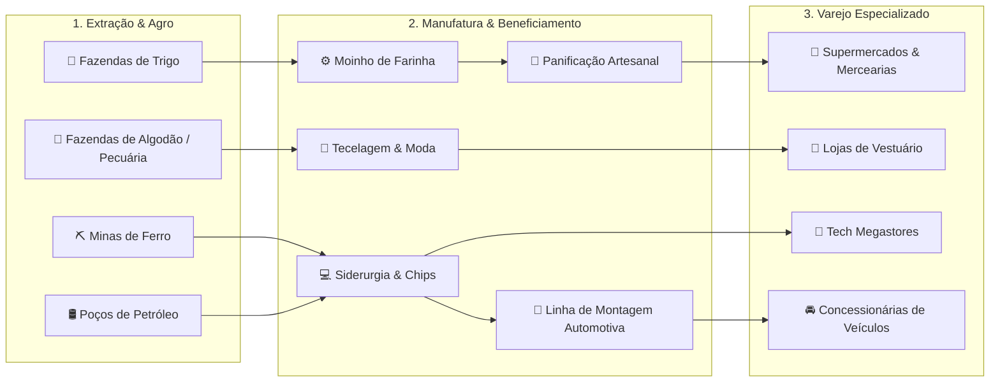

# 🏛️ OIKONOMIA — Simulador de Estratégia Econômica & Cadeia Produtiva

[](https://github.com/Jotasiete7/OIKONOMIA-game)
[](https://github.com/Jotasiete7/OIKONOMIA-game)
[](https://github.com/Jotasiete7/OIKONOMIA-game)
[-38BDF8.svg)](https://github.com/Jotasiete7/OIKONOMIA-game)
[-sky.svg)](https://github.com/Jotasiete7/OIKONOMIA-game)
[](https://github.com/Jotasiete7/OIKONOMIA-game)
[-blue.svg)](LICENSE.md)

**OIKONOMIA** é um simulador econômico e empresarial profundo inspirado em clássicos como *Capitalism Lab*, *SimCity* e *Industry Giant*. O jogo combina um motor microeconômico de tempo contínuo com um vasto continente isométrico 2.5D de 128×128 blocos, integrando extração mineral, agropecuária, manufatura industrial, logística marítima, P&D com patentes e 8 redes especializadas de varejo.

---

## 🌟 Principais Recursos & Escalas do Jogo

### 🗺️ 1. Continente Isométrico de 128×128 (16.384 Tiles)
* **Geografia Costeira & Relevo Harmônico**: Praias naturais, águas profundas, colinas, cordilheiras e vales agrícolas férteis.
* **4 Cidades com Perfis Econômicos Reais**:
  - **🏛️ Nova Atenas (38, 38)**: Capital financeira e cultural de alta renda, com demanda por bens de luxo, moda e eletrônicos de alto QR.
  - **🚢 Porto Real (94, 38)**: O maior hub portuário e logístico do continente, situado na costa oceânica oriental com altíssimo volume de comércio.
  - **🏭 Montargis (38, 88)**: Polo industrial e siderúrgico no sudoeste, cercado por cordilheiras com ricos depósitos de ferro (*Desbloqueio: $500k de Patrimônio*).
  - **🌾 Várzea (88, 88)**: Vasto cinturão agropecuário nos vales férteis do sudeste (*Desbloqueio: 1 Fazenda ativa*).
* **Malha Rodoviária Suave & Pontes**: Autoestradas contínuas de pista dupla interligando todas as cidades e terminais portuários com pontes automáticas sobre a água.

---

### 🖥️ 2. Interface em Tela Cheia & Janelas Flutuantes (Estilo *Capitalism Lab*)
* **Canvas Edge-to-Edge**: O mapa ocupa 100% da janela do navegador sem barras de rolagem.
* **HUD Superior & Inferior Translúcido**: Controle fino com relógio contínuo, velocidades (`⏸ Pausa`, `1x`, `2x`, `5x`), saldo de caixa, lucro mensal, atalhos de cidades e lentes de calor (*Terreno, Tráfego, População, Varejo, Portos, Indústria, Mídia, Oportunidade*).
* **📻 Micro Rádio OikoFM no HUD**: Tocador permanente integrado à barra inferior com 7 faixas dinâmicas de BGM, ambiência urbana e controles de loop/playlist.
* **🔊 Paisagem Sonora & Síntese Nativa**: Áudio imersivo com efeitos sonoros em WAV nativo (moedas, obras, contratos, alertas), amortecimento de volume e mixagem configurável no menu de pausa (`ESC`).
* **🪟 Card Flutuante de Gestão**: Ao clicar em qualquer prédio (loja, fábrica, fazenda ou mina), uma janela flutuante elegante abre diretamente no canto direito sobre o mapa, sem rolagem.
* **📡 Radar Minimapa Interativo**: Renderização dedicada em tempo real com retângulo de visão da câmera e **teletransporte instantâneo por clique**.

---

### ⛓️ 3. Ecossistema de Cadeia de Suprimentos Completo (Vertical Integration)



* **63+ Produtos de Consumo & Insumos Industriais**: Alimentos, bebidas, tecidos, eletrodomésticos, hardware, joias, materiais de construção e automóveis.
* **35+ Receitas Industriais**: Interface com abas por categoria (`[🌾 Alimentos]`, `[👗 Moda]`, `[💻 Tech]`, `[🚗 Veículos]`, `[⚙️ Base]`) e busca em tempo real.
* **Seletor de Fornecedores com Selos Coloridos**:
  - 👑 **SUA EMPRESA (PRODUÇÃO PRÓPRIA)**: Fornecimento direto de fábricas/fazendas próprias com **custo de produção direto e zero margem de intermediários**.
  - 🚢 **PORTO MARÍTIMO (IMPORTAÇÃO INTERNACIONAL)**: Terminais oceânicos de atacado global.
  - 🏪 **DISTRIBUIDOR REGIONAL**: Fornecedores independentes terceirizados.

---

### 💰 4. Mecânicas Imobiliárias e de Desinvestimento (*Capitalism Lab Formulas*)

| Ação | Fórmula de Cálculo | Resultado Econômico |
| :--- | :--- | :--- |
| **💰 Vender Instalação** | `(Custo_Obra × 70%) + (Estoque_Armazenado × Custo_Unitário)` | Credita o valor imediatamente no caixa, liquida o estoque a preço de custo e libera o lote. |
| **🗑️ Demolir Edifício** | `(Custo_Obra × 40%)` | Recupera o valor residual da sucata, remove a estrutura e zera o aluguel diário da terra. |

---

### 📰 5. Diário Corporativo & Ticker de Notícias em Tempo Real (Estilo Nasdaq / TortaApp)
* **Barra Fixa Superior com Aceleração por GPU**: Marquee contínuo com `translate3d` e velocidade linear configurável (30 a 90 px/s).
* **🖱️ Drag-to-Scroll Interativo**: Arraste a fita horizontalmente com o mouse para ler manchetes anteriores.
* **🎯 Jump to Latest**: Clique no badge do Diário para reiniciar o fluxo instantaneamente nas notícias mais recentes.
* **🔥 Smart Alert Pills**: Alertas de alta prioridade (marcos históricos, quebra de safras, choques de mercado e falências) com molduras iluminadas e ícones pulsantes.

---

### 🌐 6. Motor Macroeconômico & Sazonalidade dos 4 Trimestres (Estilo *Capitalism II*)
* **☀️ Sazonalidade Intra-ano (4 Trimestres de 90 dias)**:
  - **Q1 (Verão)**: +35% em bebidas e vestuário leve.
  - **Q2 (Outono)**: +25% de safra nas fazendas e panificação em alta.
  - **Q3 (Inverno)**: -20% de colheita no campo (entressafra), +40% em sopas, café, fármacos e agasalhos.
  - **Q4 (Festas)**: O Grande Trimestre de Compras (+45% em chocolates, carnes nobres e vestuário geral).
* **🏛️ Ciclos Macroeconômicos Decenais (10 Anos)**:
  - **🌱 Anos 1-2 (Retomada)**: PIB +5%, insumos estáveis.
  - **🔥 Anos 3-5 (Superaquecimento / Boom)**: Consumo +20%, insumos +15% (pressão de procura).
  - **⚠️ Anos 6-7 (Saturação)**: Desaceleração de vendas (-5%) e queima de estoques pela IA.
  - **📉 Anos 8-10 (Recessão & Liquidação / Value Investing)**: Consumo -20%, insumos no porto com -20% de desconto e patentes de concorrentes com **35% de desconto**!
* **📺 Central de Mídia & IBOPE Analytics**:
  - Pontos de IBOPE (0 a 100), alcance real em número de habitantes, CPRP (*Cost per Rating Point*) e barra de *Share of Voice* contra a concorrência.

---

## 🎮 Controles & Atalhos de Teclado

| Tecla / Comando | Ação |
| :--- | :--- |
| **`W` / `A` / `S` / `D`** ou **`Setas`** | Mover a câmera pelo mapa suavemente (60 FPS). |
| **`Scroll do Mouse`** ou **`Q` / `E`** | Zoom in / Zoom out. |
| **`Botão Esquerdo` (Arrastar)** | Panorâmica da câmera. |
| **`Clique no Lote / Prédio`** | Abrir janela flutuante de gestão ou wizard de construção. |
| **`Clique no Minimapa`** | Teletransportar a câmera diretamente para o ponto clicado. |
| **`Espaço`** | Pausar / Despausar o relógio da simulação. |
| **`Esc`** | Fechar janelas flutuantes, gavetas de DRE/Diário e abrir Configurações. |
| **`F`** | Ocultar/Restaurar painéis (Modo Teatro). |

---

## 🚀 Como Executar o Jogo

O **OIKONOMIA** oferece dois ambientes de execução independentes: um modo 100% offline para jogadores (sem qualquer dependência ou instalação) e um modo interativo para desenvolvedores com compilação em tempo real (HMR).

### 1. Modo Jogador (Execução Imediata / Standalone 100% Offline)
Não necessita de Node.js, internet ou dependências instaladas. Basta dar um duplo clique:
```cmd
JOGAR.bat
```
*O jogo abrirá instantaneamente a versão compilada e otimizada (`dist/index.html`) no seu navegador padrão com motor gráfico, texturas, áudio sintetizado e estilos Tailwind v4 processados localmente.*

---

### 2. Modo Desenvolvedor (Vite Dev Server com Live Reload / HMR)
Para programar, testar mudanças de código em tempo real e debugar:
1. Certifique-se de ter o [Node.js](https://nodejs.org/) instalado na máquina.
2. Dê um duplo clique no script:
```cmd
JOGAR_DEV.bat
```
*(Ou execute manualmente no terminal: `npm run dev`)*
*O servidor de desenvolvimento do Vite iniciará em `http://localhost:5173/` e abrirá a janela do navegador automaticamente com suporte a Hot Module Replacement (HMR).*

### 🛠️ Scripts de Desenvolvimento (`package.json`)
```bash
npm run dev               # Inicia o servidor Vite de desenvolvimento com HMR (porta 5173)
npm run build             # Compila o bundle IIFE autônomo na pasta dist/ para distribuição offline
npm run preview           # Pré-visualiza localmente o build da pasta dist/ via HTTP local
npm run audit-browser     # Executa bateria E2E no Chromium/Edge headless via Chrome DevTools Protocol
npm run audit-deep        # Executa simulação contínua de 365 ticks validando DRE, IA e Saves
npm run audit-graph       # Valida matematicamente as 77 receitas industriais e cadeias de insumos
```

---

## 📂 Arquitetura & Estrutura Modular do Projeto

O código foi inteiramente refatorado e desacoplado em módulos padronizados **ES Modules (ESM)**, estilizado com **Tailwind CSS v4 local** (eliminando dependências externas de CDN) e empacotado pelo **Vite 8**:

```
OIKONOMIA/
├── client/                        # Código-fonte da aplicação cliente (ES Modules)
│   ├── index.html                 # Shell HTML com Canvas 2D, HUD e modais de gestão
│   ├── main.js                    # Entry point Vite (orquestra imports e expõe compatibilidade global)
│   ├── style.css                  # Folha de estilos local com Tailwind CSS v4 (@import "tailwindcss";)
│   ├── game_state.js              # Container reativo do estado global (Single Source of Truth)
│   ├── save_system.js             # Pipeline de persistência (.oiko/localStorage), schemas e migrações
│   ├── game_config.js             # Catálogos de configuração (24 avatares, dificuldades, paletas de cor)
│   ├── logo_generator.js          # Gerador procedural determinístico de brasões corporativos (SVG)
│   ├── core_math.js               # Motor matemático puro (elasticidade, ratings, P&D e sazonalidade)
│   ├── data_catalogs.js           # Catálogos estáticos de 99 produtos, 77 receitas, lojas e mídias
│   ├── map_data.js                # Camadas compiladas TMX e matrizes do continente 128×128
│   ├── sprite_manager.js          # Gerenciador e cache assíncrono de texturas e sprites isométricos
│   ├── audio.js                   # Sistema de áudio procedural e sintetizador Web Audio API
│   ├── ticker_system.js           # Módulo do Diário Corporativo / Ticker superior interativo
│   ├── macro_cycle_system.js      # Módulo macroeconômico de ciclos decenais de 10 anos
│   └── assets/                    # Texturas, spritesheets e efeitos de áudio WAV/MP3
├── data/                          # Especificações e dados estáticos de suporte
│   ├── maps/                      # Mapas isométricos no formato Tiled (.tmx)
│   ├── cities/                    # Demografia e perfis socioeconômicos dos distritos
│   └── products/                  # Especificações técnicas e cadeias de insumos
├── dist/                          # Build de produção final (bundle IIFE 100% autônomo e offline)
├── docs/                          # Documentação, GDD, DevLog e relatórios de auditoria
├── tools/                         # Suítes de testes automatizados E2E via CDP Headless
├── JOGAR.bat                      # Inicializador do jogador (execução standalone via dist/index.html)
├── JOGAR_DEV.bat                  # Inicializador de desenvolvimento (Vite Dev Server com HMR)
├── package.json                   # Dependências do projeto (Vite 8, Tailwind CSS v4)
└── vite.config.mjs                # Configuração do Vite com suporte duplo (dev server e file:///)
```

---

## 📜 Licença (Modelo Híbrido)

Este projeto adota um **modelo de licenciamento duplo**:
* **💻 Motor & Código-fonte:** Licenciado sob a licença permissiva **MIT**.
* **🎨 Modelos 3D, Sprites, Artes Visuais & Marca "OIKONOMIA":** **Todos os direitos reservados** (*All Rights Reserved* — Copyright © 2026). Proibida a redistribuição ou exploração comercial dos assets artísticos sem autorização expressa.

Consulte o arquivo [LICENSE.md](LICENSE.md) para os termos jurídicos completos.
