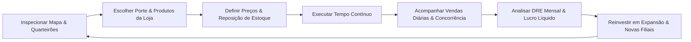

# GDD — OIKONOMIA (Game Design Document)

## 1. Visão do Jogo
**OIKONOMIA** é um simulador de estratégia econômica e gestão corporativa profunda, combinando:
- **Macro e Microeconomia Realista:** Formação de preços, curvas de elasticidade de demanda, poder de marca, qualidade de insumos e demonstrativos contábeis reais (DRE, Fluxo de Caixa, Balanço Patrimonial).
- **Geografia Urbana e Território:** A localização de cada filial (quarteirão, fluxo de pedestres, valor do lote) impacta diretamente as vendas e custos fixos.
- **Loop Temporal Contínuo:** Relógio contínuo com controle de velocidade (Pausa, 1x, 2x, 5x) com eventos diários e fechamento contábil mensal.

---

## 2. Pilares de Design

1. **Rigor Microeconômico:**
   A atratividade dos produtos segue o modelo de escolha discreta ponderando Qualidade ($W_q$), Marca ($W_b$) e Preço ($W_p$).
2. **Sensibilidade de Demanda (Necessity Index):**
   Itens essenciais (Pão, Leite) possuem curvas inelásticas; itens de impulso/luxo sofrem quedas acentuadas de volume sob sobrepreço.
3. **Território & Quarteirões:**
   A cidade é segmentada em distritos com diferentes densidades demográficas, níveis de renda e fluxos de pedestres (`Traffic Index` 0–100).
4. **Competição Dinâmica & Guerra de Preços:**
   Concorrentes de IA monitoram market share por quarteirão, reagindo com ajustes de margem e cortes de preço para recuperar clientes.

---

## 3. Core Loop do Jogador

---

## 4. Estrutura de Fases do Projeto

- **Fase 1 (Atual - v0.3):** Núcleo Econômico, Tempo Contínuo, Mapa Isométrico 2D, Wizard de Abertura de Estabelecimentos (Kombini / Mercadinho / Supermercado) e Fechamento DRE Mensal.
- **Fase 2 (Próxima):** Portos de Importação, Cadeia de Fornecedores, Fazendas e Fábricas de Transformação de Insumos.
- **Fase 3:** Centros de Pesquisa & Desenvolvimento (P&D / R&D), Mídia & Campanhas Publicitárias (TV, Rádio, Jornal).
- **Fase 4:** Mercado de Capitais, Empréstimos Bancários, Emissão de Ações e M&A.
