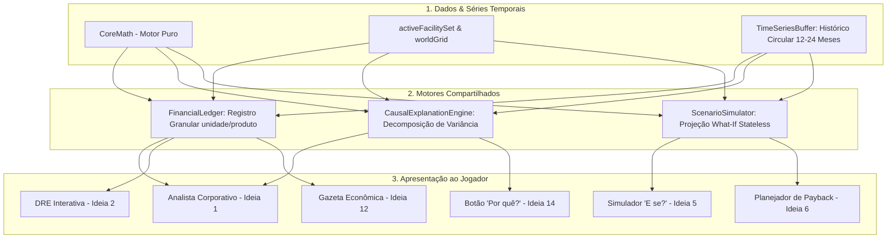

# 📋 Diagnóstico Arquitetural & Roadmap de Ferramentas de Causalidade Econômica — OIKONOMIA

> **Documento Oficial de Planejamento & Inteligência de Negócios**  
> **Data:** 31 de Agosto de 2026 — `v0.8.1`  
> **Status:** 🔒 **ARQUIVADO PARA EXECUÇÃO FUTURA — NÃO INICIAR SEM VALIDAÇÃO DA FASE 0**  
> **Origem:** Análise Multidisciplinar (Design Sistêmico + Auditoria de Código Antigravity + Validação Cruzada Claude)  
> **Arquivos Inspecionados no Código Real:** `client/index.html`, `client/core_math.js`, `client/data_catalogs.js`, `client/map_data.js`, `data/cities/city-profiles.json`, `tools/validate_market_balance.js`, `tools/audit_6_deep_systems.js`

---

## 0. Contexto & Propósito Deste Documento

Este documento preserva integralmente a análise técnica das 14 ferramentas de diagnóstico econômico e causalidade (Analista Corporativo, DRE Interativa, Simulador "E se?", Botão "Por quê?", Lente de Oportunidade, etc.).

Todas as citações de arquivos, funções e variáveis foram **validadas linha por linha contra o código real do repositório**. Ele serve como o guia canônico para quando o projeto entrar na fase de implementação de ferramentas avançadas de inteligência corporativa.

---

## 1. Diagnóstico Geral da Arquitetura Atual

### Pontos Fortes Validados:
- **`client/core_math.js` (Funções Puras & Determinísticas):** Todas as equações microeconômicas (Product Rating, Elasticidade-preço, Divisão Quadrática de Market Share, Landed Cost, P&D Assintótico) são stateless e sem efeitos colaterais. Base perfeita para o Simulador "E se?".
- **Grafo de Cadeia Produtiva Completo:** 99 produtos, 77 receitas, 14 culturas agropecuárias e 7 jazidas minerais (`client/data_catalogs.js`), auditados contra loops recursivos por `tools/audit_production_graph.js`.
- **Sparse Indexing de Alta Performance:** O loop diário em `simulateDay()` itera apenas sobre `activeFacilitySet` em $O(k)$ em vez de percorrer os 16.384 tiles do mapa $128 \times 128$.

### Gargalos e Bloqueadores Centrais Identificados:
1. **Amnésia Contábil (Bloqueador Mandatório):** Em `client/index.html:L6886`, no fechamento mensal (`closeMonthEnd`), os acumuladores `monthRevenue`, `monthCogs`, `monthFixedExpenses` e `monthMarketingExpenses` são zerados sem armazenar uma série temporal dos últimos 12 a 24 meses. **É o bloqueador central para qualquer ferramenta que calcule deltas ($\Delta$) ou causas de variação.**
2. **Monólito em `client/index.html` (8.576 linhas):** Interface, áudio, canvas, estado global e simulação diária coexistem no mesmo arquivo.
3. **IA Concorrente Acoplada ao Tile:** A IA concorrente não é uma corporação autônoma; é uma propriedade `tile.competitor` no grid, com disputa restrita a vizinhos imediatos ($\Delta x, \Delta y = \pm 1$).
4. **Teletransporte na Cadeia de Suprimentos:** O consumo de matérias-primas por fábricas subtrai estoque da fazenda/mina remota e credita na fábrica instantaneamente no mesmo tick, calculando o frete no preço mas sem tempo de trânsito físico (*lead-time*).
5. **Determinismo vs `Math.random()` Solto:** Uso de números aleatórios não semeados em ruídos de demanda e decisões de preço impede replays e testes determinísticos.

---

## 2. As 14 Ideias Avaliadas — Matriz de Decisão Técnica

| # | Ideia | Viabilidade | Esforço | Impacto Gameplay | Impacto Arq. | Risco | Prioridade | Resumo & Proposta Técnica |
| :-: | :--- | :---: | :---: | :---: | :---: | :---: | :---: | :--- |
| **1** | **Analista Corporativo** | 🟢 Alta | Baixo | Muito alto | Pequeno | Baixo | **10 / 10** | Decomposição exata de variância contábil ($\Delta \text{Lucro} = \Delta P \cdot Q + P \cdot \Delta Q - \Delta \text{CPV} - \Delta \text{Fixos}$) sem IA generativa nem heurísticas inventadas. |
| **2** | **DRE Interativa (Drill-Down)** | 🟢 Alta | Médio | Muito alto | Médio | Baixo | **9 / 10** | Tabela hierárquica expansível (TreeGrid): Consolidado $\to$ Unidade $\to$ Produto $\to$ Decomposição ($Preço \times Volume$, CPV, Frete, Market Share). |
| **3** | **Mapa: Lente de Oportunidade** | 🟢 Alta | Muito baixo | Alto | Nenhum | Baixo | **9 / 10** | Lente composta no Canvas: $\text{Oportunidade} = \frac{\text{Demanda Teórica}}{\text{Oferta Instalada} + \text{Informal}} \times \text{Margem Líquida}$. Atualizada sob demanda. |
| **4** | **Vazio de Mercado (Market Gap)** | 🟢 Alta | Baixo | Alto | Pequeno | Baixo | **8 / 10** | Painel municipal comparando Demanda Potencial Teórica vs. Capacidade Instalada de Gôndolas, identificando categorias subatendidas. |
| **5** | **Simulador "E se?" (Sandbox)** | 🟢 Alta | Baixo | Muito alto | Nenhum | Baixo | **10 / 10** | Projeção preditiva stateless na gôndola via `CoreMath` puro: estima vendas, margem e lucro sob novos preços com faixas pessimista/base/otimista. |
| **6** | **Planejador de Investimento** | 🟢 Alta | Muito baixo | Alto | Nenhum | Baixo | **8 / 10** | Calculadora de Payback e Capex no Wizard de Obras, portando a rotina já validada em `tools/validate_market_balance.js`. |
| **7** | **Custo de Oportunidade na Cadeia** | 🟢 Alta | Baixo | Médio | Nenhum | Baixo | **7 / 10** | Tabela na Enciclopédia (`F1`) calculando o Valor Marginal por Unidade de Insumo Raiz (vender minério bruto vs produzir aço vs montar carros). |
| **8** | **Estoque como Capital de Giro** | 🟢 Alta | Muito baixo | Alto | Nenhum | Baixo | **9 / 10** | Badges visuais no card da instalação: Dias de Cobertura ($Estoque / Vendas$), Capital Imobilizado ($Estoque \times Custo$) e Risco de Ruptura. |
| **9** | **Logística como Sistema Econômico**| 🟡 Média | Médio | Alto | Médio | Médio | **7 / 10** | Fila de lotes em trânsito com *Lead-Time* discreto ($\lceil Distância / Velocidade \rceil$) e Armazéns Regionais. Frotas visuais apenas decorativas. |
| **10**| **Vantagens Competitivas (Radar)** | 🟢 Alta | Muito baixo | Médio | Nenhum | Baixo | **7 / 10** | Gráfico de Radar no QG comparando os 5 eixos reais (Custo, Qualidade, Marca, Distribuição, Tecnologia) contra a média dos rivais. |
| **11**| **IA Concorrente com Arquétipos** | 🟡 Média | Alto | Muito alto | Grande | Médio | **8 / 10** | Desacoplar IA do tile e criar corporações com Utility AI e personalidades (Discount, Premium, Industrialista, Trader). |
| **12**| **Jornal Econômico Procedural** | 🟢 Alta | Baixo | Alto | Pequeno | Baixo | **8 / 10** | Gazeta mensal via templates orientados a eventos reais da simulação (inflação de produto, expansão de rede, guerra de preços da IA). |
| **13**| **Eventos Emergentes em Cascata** | 🟡 Média | Alto | Muito alto | Grande | 🔴 Alto | **6 / 10** | Choques climáticos e macroeconômicos em cadeia. **Exige amortecedores portuários obrigatórios para evitar espiral de morte.** |
| **14**| **Botão "Por quê?" (Causal Engine)**| 🟢 Alta | Médio | Muito alto | Médio | Baixo | **10 / 10** | Botão `[?]` universal em qualquer KPI que abre gaveta com a árvore de derivadas e fatores que causaram a variação no mês. |

---

## 3. Avisos Críticos de Engenharia

> [!CAUTION]
> **REGRAS DE SEGURANÇA ARQUITETURAL PARA NÃO ESQUECER:**
> 1. **Amortecedor Portuário Mandatório para a Ideia 13:** Nunca implementar choques em cadeia (ex: seca de trigo $\to$ farinha $\to$ pão $\to$ fechamento de padarias) sem que os Portos Marítimos atuem simultaneamente como *Teto de Preço Internacional (Price Ceiling)* com oferta elástica. Sem isso, o modelo entra em colapso irreversível (*death spiral*).
> 2. **Proibido Pathfinding Físico A\* de Caminhões:** Simular centenas de veículos individuais colidindo em vias destruirá o FPS do Canvas sem trazer nenhum ganho microeconômico. A logística deve ser tratada como **filas de entrega agregadas com lead-time discreto**, e caminhões no asfalto apenas como partículas decorativas.
> 3. **Proibido Monte Carlo Pesado no Navegador:** Para o Planejador de Investimento (Ideia 6), usar intervalos de sensibilidade determinísticos (Pessimista / Base / Otimista). Simulações estocásticas de 10.000 iterações são lentas e opacas para o jogador.
> 4. **Sem "Árvores de Perks Mágicas" para Vantagens Competitivas:** A Ideia 10 é puramente uma lente diagnóstica sobre dados existentes (Custo, Qualidade, Marca, Distribuição, P&D), e não uma mecânica separada com bônus arbitrários.

---

## 4. Arquitetura Compartilhada (4 Módulos Reutilizáveis)

---

## 5. Ordem de Execução Recomendada (Roadmap de Retomada)

### 🧪 Fase 0 — Confirmação Empírica de Balanceamento (Playtest First)
- **Ação:** Rodar playtest de 1 a 2 horas para validar se as travas recentes (gating de P&D por tier, licenciamento de nicho, custo de solo e curva assintótica de QR) resolveram o feedback de "lucro fácil demais / sem desafio".
- **Critério:** Não construir ferramentas de explicação de lucros antes de garantir que a economia do jogo está na faixa saudável de dificuldade.

### ⚡ Fase 1 — Quick Wins de Leitura Pura (Zero Risco / Stateless)
*Podem ser feitos a qualquer momento pois só leem o estado existente via `CoreMath`:*
1. **Simulador "E se?" na Gôndola (Ideia 5)**
2. **Lente de Oportunidade de Mercado no Mapa (Ideia 3)**
3. **Métricas de Cobertura de Estoque e Capital Imobilizado (Ideia 8)**
4. **Calculadora de Payback no Wizard de Obras (Ideia 6)**

### 🧱 Fase 2 — Fundação de Dados Históricos
*Pré-requisito técnico mandatório para causalidade:*
1. **`TimeSeriesBuffer`**: Buffer circular de 12 a 24 meses registrando receita, custo, volume, market share e preços por produto e por filial.
2. **`FinancialLedger`**: Registro granular `[unidade_id][produto_id]` para DRE Consolidada e DRE por Filial.
*(Candidato ideal para nascer no formato modular da migração TypeScript).*

### 🔍 Fase 3 — Inteligência Causal & Diagnóstico
*Alimentadas pela Fundação da Fase 2:*
1. **Botão "Por quê?" (Causal Explanation Engine - Ideia 14)**
2. **DRE Interativa com Drill-Down Hierárquico (Ideia 2)**
3. **Analista Corporativo Automatizado (Ideia 1)**

### 📰 Fase 4 — Narrativa & Inteligência Estratégica
1. **Gazeta Econômica Procedural (Jornal - Ideia 12)**
2. **Radar de Vazio de Mercado (Market Gap - Ideia 4)**
3. **Custo de Oportunidade de Matérias-Primas (Ideia 7)**
4. **Painel de Vantagens Competitivas (Ideia 10)**

### ⏳ Fase 5 — Grandes Reformulações Estruturais (Adiado / Longo Prazo)
- **IA Concorrente com Arquétipos Autônomos (Ideia 11)**: Desacoplar rivais do grid e criar entidades corporativas.
- **Logística por Lead-Time e Armazéns Regionais (Ideia 9)**: Fila de entrega temporal com armazéns centrais.
- **Eventos Macroeconômicos em Cascata (Ideia 13)**: Choques sazonais com amortecedores portuários.

---

## 6. Como Retomar Este Documento

Quando for decidido iniciar este pacote de melhorias:
1. Revise o resultado dos playtests da **Fase 0**.
2. Escolha entre implementar os **Quick Wins da Fase 1** (leitura pura e retorno imediato) ou abrir uma sessão focada exclusivamente na **Fase 2 (`TimeSeriesBuffer` + `FinancialLedger`)**, testando-a com testes unitários antes de acoplar à interface.
